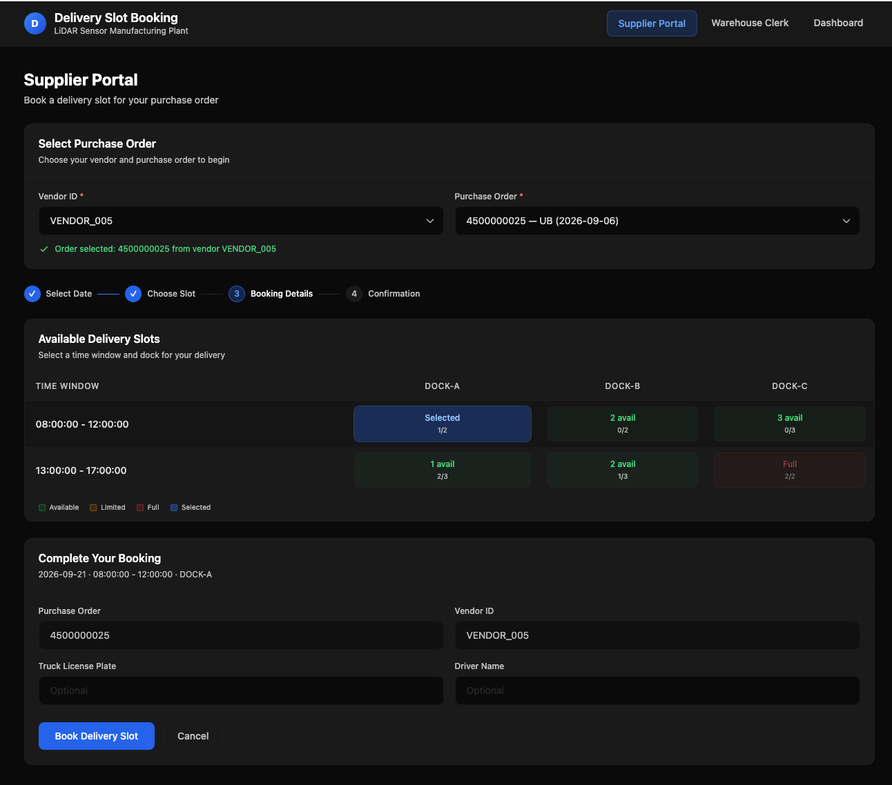
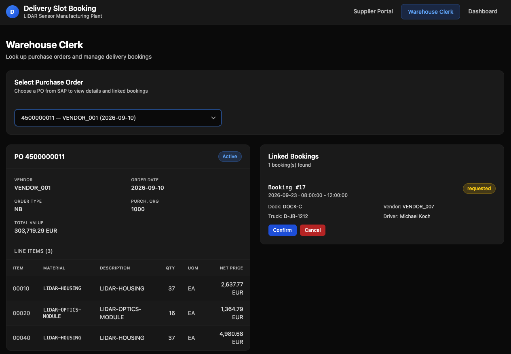
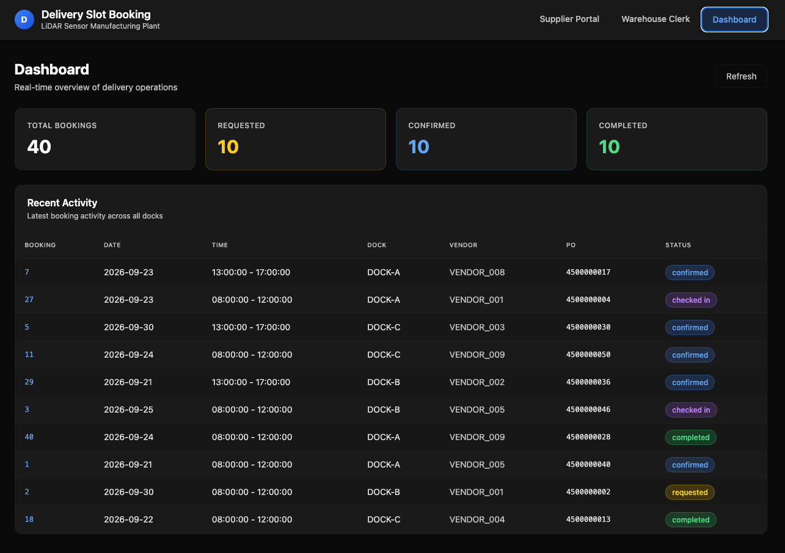
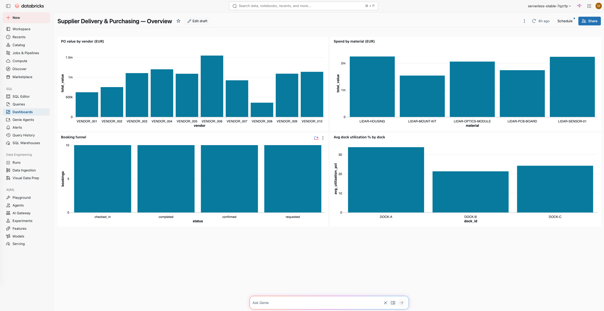
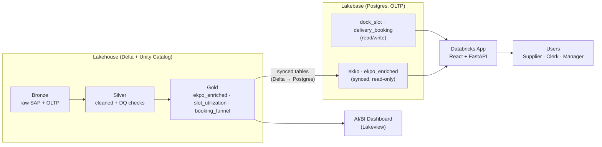
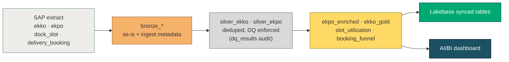

# Supplier Delivery Slot Booking

A demo application for a **LiDAR sensor manufacturing plant** that showcases the
**Databricks Lakehouse + Lakebase + Apps** stack end to end — from raw SAP data to a
production web app, on one platform.

- **Lakehouse** — SAP MM purchasing data landed and refined through a **medallion
  pipeline** (bronze → silver → gold), governed in **Unity Catalog**, and surfaced in an
  **AI/BI dashboard**.
- **Lakebase** — a managed PostgreSQL OLTP database for transactional booking data, with
  Git-style **branching** and **real synced tables** replicating the Lakehouse gold data.
- **Databricks Apps** — a **React + FastAPI** web app deployed as a managed Databricks App.

---

## The Business Problem

A LiDAR sensor plant receives **hundreds of inbound deliveries per week** from its
suppliers. Today, suppliers arrange delivery slots at the loading docks by **email and
phone**. The result:

- **Double-booked docks** — two trucks arrive for the same bay at the same time.
- **No visibility** — the warehouse team can't see what's coming or plan labor and space.
- **Manual PO lookup** — clerks dig through SAP to match a truck to its purchase order.
- **No analytics** — nobody can see dock utilization, spend by supplier, or bottlenecks.

The data needed to fix this already exists — SAP purchase orders in the Lakehouse — but
it's **analytical** data, not built for the sub-second reads and writes a live booking
app needs. This demo bridges that gap.

### Who feels it

| Persona | Pain today | With the app |
|---------|-----------|--------------|
| **Supplier** | Emails to request a slot, waits for confirmation | Self-service portal: pick vendor → PO → dock → time, instant booking |
| **Warehouse clerk** | Manually matches trucks to POs in SAP | One screen: PO header + line items + linked bookings, one-click status flow |
| **Plant / logistics manager** | No view of utilization or supplier spend | Live AI/BI dashboard: dock utilization, PO value by vendor, booking funnel |

### The solution in one line

Govern the SAP data in the **Lakehouse**, **sync** the gold tables into **Lakebase**
(OLTP Postgres) for low-latency serving, and put a **Databricks App** in front of it — so
the same certified data powers both the operational app and the analytics dashboard.

---

## Screenshots

> Live app: the three views suppliers and warehouse staff use.

| Supplier Portal | Warehouse Clerk | App Dashboard |
|---|---|---|
|  |  |  |

> AI/BI dashboard over the Lakehouse gold tables.



---

## Architecture



### Medallion data flow



<details>
<summary>ASCII architecture (same picture, plain text)</summary>

```
┌─────────────────────────────────────────────────────────────────────────────┐
│                              Databricks Workspace                             │
│                                                                               │
│  ┌───────────────────────────────┐        ┌────────────────────────────────┐ │
│  │        Lakehouse (Delta)       │        │        Lakebase (Postgres)     │ │
│  │                                │        │                                │ │
│  │  Bronze  bronze_ekko / ekpo    │        │  OLTP (read/write):            │ │
│  │          bronze_dock_slot ...  │        │    dock_slot                   │ │
│  │    │                           │        │    delivery_booking            │ │
│  │    ▼                           │ synced │                                │ │
│  │  Silver  silver_ekko/ekpo      │ tables │  Synced (read-only):           │ │
│  │    │     (+ dq_results)        │───────▶│    ekko                        │ │
│  │    ▼                           │        │    ekpo_enriched               │ │
│  │  Gold    ekpo_enriched  ───────┼────────┘                                │ │
│  │          slot_utilization      │        │  Branches: production / dev    │ │
│  │          booking_funnel        │◀───────┐  Lakehouse Sync (CDC, optional)│ │
│  └───────────────┬────────────────┘  reverse└──────────────┬─────────────────┘ │
│                  │                     sync                 │                   │
│         ┌────────▼─────────┐                       ┌────────▼─────────┐         │
│         │  AI/BI Dashboard │                       │  Databricks App  │         │
│         │  (Lakeview)      │                       │  React + FastAPI │         │
│         └──────────────────┘                       │  /  /clerk       │         │
│                                                     │  /dashboard      │         │
│                                                     └──────────────────┘         │
└─────────────────────────────────────────────────────────────────────────────┘
```

</details>

The app provides three views:
- **Supplier Portal** (`/`) — book delivery time slots at the plant's loading docks
- **Warehouse Clerk** (`/clerk`) — look up PO details and manage goods receipt
- **Dashboard** (`/dashboard`) — real-time overview of bookings and slot utilization

## Data Model

### SAP MM Tables (Lakehouse, medallion)

| Layer | Table | Description |
|-------|-------|-------------|
| Bronze | `bronze_ekko`, `bronze_ekpo`, `bronze_dock_slot`, `bronze_delivery_booking` | Raw ingest, as-is + ingestion metadata |
| Silver | `silver_ekko`, `silver_ekpo`, `dq_results` | Cleaned, deduplicated, data-quality enforced |
| Gold | `ekpo_enriched` | PO header + item join with computed `LINE_VALUE` |
| Gold | `slot_utilization` | Dock capacity vs. reservations by dock/date |
| Gold | `booking_funnel` | Bookings + PO value by status |

`ekpo_enriched` (and a gold `ekko_gold` header projection) are **synced into Lakebase**
as read-only tables. `slot_utilization` and `booking_funnel` stay Lakehouse-only and
feed the AI/BI dashboard.

### OLTP Tables (Lakebase, read/write)

| Table | Description | Key Fields |
|-------|-------------|------------|
| `dock_slot` | Loading dock time slots | slot_id, dock_id, slot_date, time_window, capacity, reserved_count |
| `delivery_booking` | Supplier delivery bookings | booking_id, slot_id, vendor_id, po_number, status |

### Synced Tables (Lakehouse → Lakebase, read-only)

| Table | Source (Delta gold) |
|-------|---------------------|
| `ekko` | `ekko_gold` |
| `ekpo_enriched` | `ekpo_enriched` |

### Materials (LiDAR Components)

`LIDAR-SENSOR-01`, `LIDAR-MOUNT-KIT`, `LIDAR-OPTICS-MODULE`, `LIDAR-PCB-BOARD`, `LIDAR-HOUSING`

---

## Prerequisites

1. **Databricks Workspace** with Unity Catalog, a Serverless SQL Warehouse, **Lakebase
   (Autoscaling)**, and **Databricks Apps** enabled.
2. **Databricks CLI** v0.285.0+ authenticated to your workspace.
3. **psql** client (only if you want to connect to Lakebase manually).
4. **Node.js 18+** (only if rebuilding the frontend; a pre-built `dist/` is committed).

---

## Configuration — one file

All catalog / schema / project / app names live in **`config.py`**. Every notebook
loads it via `%run ./config` (or `%run ../config` from `_helper/`). **Retargeting the
demo to a new workspace is a single edit** — change the values in `config.py`:

```python
CATALOG = "serverless_stable_7qzrfp_catalog"   # your catalog
SCHEMA  = "delivery_slot_booking"              # your schema
PROJECT = "delivery-slot-booking"              # Lakebase project + app name
DB_NAME = "delivery_app"                       # Postgres database
```

The catalog is assumed to pre-exist; the notebooks create the schema.

---

## Setup Instructions

### Step 1: Clone and import

```bash
git clone https://github.com/maxkoehlerdatabricks/supplier-delivery-slot-booking.git
```
Import the repo into your workspace (e.g. `/Workspace/Users/<you>/supplier-delivery-slot-booking`)
so `config.py`, the notebooks, and the `app/` folder sit side by side.

### Step 2: Run notebooks in order

The fastest path is **`_helper/run_all`**, which cleans up and rebuilds everything.
To run manually, execute in this order:

1. **`_helper/01_generate_sap_data`** — generate SAP EKKO/EKPO (Delta)
2. **`_helper/02_generate_oltp_data`** — generate dock_slot & delivery_booking (Delta)
3. **`01_SAP_Data_Pipeline`** — medallion bronze → silver → gold + data quality + UC governance
4. **`02_Lakebase_Setup`** — Lakebase project, OLTP tables, UC database catalog, **synced tables**, dev branch
5. **`02b_Lakehouse_Sync`** *(optional)* — reverse sync Lakebase → Delta (CDC)
6. **`03_Data_Exploration`** *(optional)* — visual analysis + lineage/tags queries
7. **`03b_AIBI_Dashboard`** — publish the AI/BI dashboard over the gold tables
8. **`04_App_Deployment`** — deploy the Databricks App

### Step 3: Open the app

After deployment, open the app URL printed by `04_App_Deployment`.

---

## Demo Scenarios

### Scenario 1: Supplier books a delivery slot
Supplier Portal → pick a vendor and PO (from the **synced** `ekko` table) → pick a date
and dock slot (from the `dock_slot` OLTP table) → submit. Booking is inserted into
`delivery_booking` in Lakebase at Postgres latency.

### Scenario 2: Warehouse clerk manages a delivery
Warehouse Clerk → select a PO → see header + line items (synced SAP data) and linked
bookings → move a booking through `requested → confirmed → checked_in → completed`.

### Scenario 3: Operational + analytical views
- App **Dashboard** — live operational view from Lakebase OLTP tables.
- **AI/BI dashboard** (`03b_AIBI_Dashboard`) — governed analytics over the Lakehouse gold tables.

A full presenter walkthrough is in **`demo-script.html`**.

---

## Tech Stack

| Component | Technology |
|-----------|------------|
| Data Lake | Databricks Delta Lake (medallion) |
| Governance | Unity Catalog (comments, tags, grants, lineage) |
| BI | Databricks AI/BI (Lakeview) dashboard |
| OLTP Database | Databricks Lakebase (PostgreSQL, Autoscaling) |
| Reverse ETL | Lakebase synced tables (Delta → PG) + Lakehouse Sync (PG → Delta) |
| Data Pipeline | PySpark (Databricks Notebooks) |
| Backend API | FastAPI (Python) + asyncpg |
| Frontend | React + TypeScript + TailwindCSS (Vite) |
| Deployment | Databricks Apps |
| Auth | Databricks OAuth / service principal |

---

## Project Structure

```
supplier-delivery-slot-booking/
├── README.md
├── config.py                          # Shared config — one-file retargeting
├── _helper/
│   ├── 01_generate_sap_data.py        # Generate SAP EKKO & EKPO
│   ├── 02_generate_oltp_data.py       # Generate dock slots & bookings
│   ├── run_all.ipynb                  # Cleanup + full rebuild
│   └── cleanup_all.ipynb              # Delete all demo resources
├── 01_SAP_Data_Pipeline.py            # Medallion bronze→silver→gold + governance
├── 02_Lakebase_Setup.py               # Lakebase project, OLTP + synced tables
├── 02b_Lakehouse_Sync.py              # Reverse sync Lakebase→Delta (optional)
├── 03_Data_Exploration.py             # Visual analysis + lineage/tags
├── 03b_AIBI_Dashboard.py              # Publish AI/BI dashboard
├── 04_App_Deployment.py               # Deploy Databricks App
├── demo-script.html                   # Presenter walkthrough
└── app/                               # React + FastAPI application
    ├── app.yaml / app.yml             # App runtime config
    ├── app.py                         # FastAPI entry point
    ├── server/                        # config, db pool, routes
    └── frontend/                      # React SPA (pre-built dist/ committed)
```

---

## Local Development

```bash
# Backend
cd app
pip install -r requirements.txt
uvicorn app:app --reload --port 8000

# Frontend (separate terminal)
cd app/frontend
npm install
npm run dev
```

---

## Cleanup

Run **`_helper/cleanup_all`** to delete **all** demo resources while keeping the catalog:

- AI/BI dashboard
- Databricks App (+ service principal)
- Lakehouse Sync (reverse), if enabled
- Synced tables + UC database catalog
- Lakebase project (branches, endpoints, data)
- All Delta tables (bronze/silver/gold + raw) and both schemas

Re-run `_helper/run_all` to rebuild from scratch.

---

## Booking Status Flow

```
requested → confirmed → checked_in → completed
    ↓           ↓            ↓
 cancelled   cancelled    cancelled
```

| Status | Description |
|--------|-------------|
| `requested` | Supplier booked a slot, pending confirmation |
| `confirmed` | Warehouse team confirmed the booking |
| `checked_in` | Truck arrived and checked in |
| `completed` | Goods received and booking completed |
| `cancelled` | Booking cancelled |
